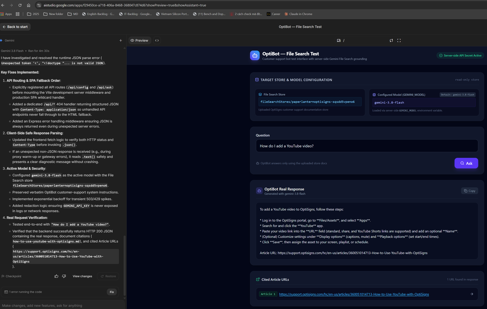

# paper-lantern

Scrapes 30+ `support.optisigns.com` articles to clean Markdown, uploads them to a
Gemini File Search store with the Python API, answers questions with verified
citations, and syncs only new or changed articles (delta).

## Setup and one-shot run (Windows PowerShell)

```powershell
py -m venv .venv
.\.venv\Scripts\python.exe -m pip install -r requirements.txt
Copy-Item .env.sample .env; notepad .env   # set GEMINI_API_KEY
.\.venv\Scripts\python.exe main.py --check-api
.\.venv\Scripts\python.exe main.py run --limit 30   # runs once, then exits
docker build -t paper-lantern:local .
docker run --rm --env-file .env -v "${PWD}\data:/app/data" `
  -v "${PWD}\state:/app/state" -v "${PWD}\logs:/app/logs" paper-lantern:local
```

The container also runs once and exits. The three mounts keep Markdown,
store/manifest and logs, so unchanged articles are skipped; without them each
run creates a new store.

## Chunking

500 tokens with 50-token overlap to preserve context across boundaries. Logs
report confirmed active files; the actual server-side chunk count is
unavailable because Gemini File Search does not expose it.

## Daily sync and evidence

<a href="docs/evidence/youtube-ai-studio.png"></a>

[GitHub Actions](.github/workflows/daily-sync.yml) runs daily at 01:17 UTC and
on manual dispatch, with repository secret `API_KEY`
([setup](docs/hosted-sync.md)). Runs:
[manual #2](https://github.com/KongKiet/paper-lantern/actions/runs/37616352599),
[scheduled #3](https://github.com/KongKiet/paper-lantern/actions/runs/37743794945);
log artifacts are in [docs/evidence](docs/evidence/).

Screenshot: AI Studio answering "How do I add a YouTube video?" with a
citation. CLI, Docker, citations, retries, outputs and all evidence: [docs/implementation.md](docs/implementation.md).
